# gold-inflation-hedge-analysis
Comparative analysis of Gold as an inflation hedge in Germany vs. India

## Exploratory Data Analysis (EDA) Results

<table>
<table>
  <tr><th colspan="2" align="left"><h3>Correlation Analysis</h3></th></tr>
  <tr>
    <td valign="top" width="400">
      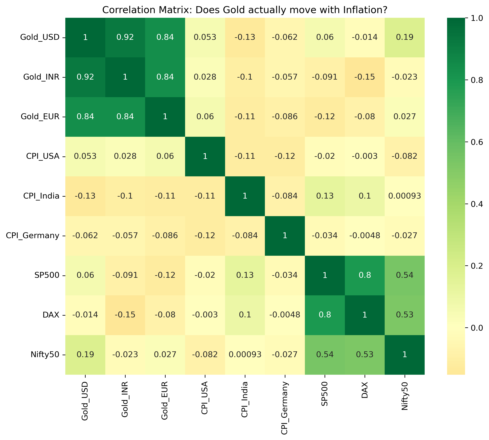
    </td>
    <td valign="top">
      <ul>
        <li><strong>-1.0:</strong> Opposite movement; <strong>+1.0:</strong> Identical movement; <strong>0:</strong> No relationship.</li>
        <li>Helps determine if Gold provides a "hedge" (low or negative correlation) during periods when equity markets (S&P 500, DAX, Nifty50) are underperforming.</li>
        <li>Compares how closely localized Gold (e.g., Gold_INR) tracks with local inflation (CPI_India) versus global prices.</li>
      </ul>
    </td>
  </tr>
</table>
<table>
  <tr><th align="left"><h3>Risk vs. Return & Volatility</h3></th></tr>
  <tr>
    <td align="center">

This plot maps assets on the Efficient Frontier, highlighting the trade-off between total return and historical volatility. 
 Points closer to the upper-left represent optimal "low-stress" investments, whereas rightward shifts indicate increased risk exposure for the same return. <em>Note: As these are absolute values, high returns here do not always equate to "smart" investments, as this Risk vs. Return chart does not adjust for the local risk-free rates of each specific economy.</em>

    </td>
  </tr>
  <tr>
    <td align="center">
      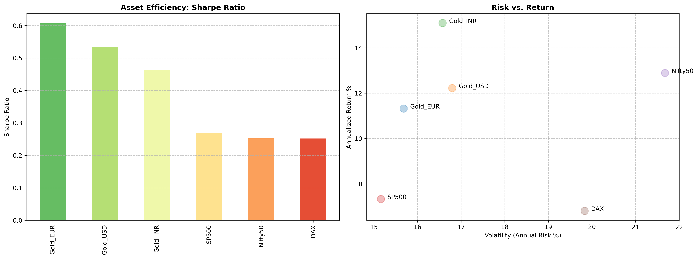
    </td>
  </tr>
</table>

<table>
  <tr><th colspan="2" align="left"><h3>Efficiency vs. Volatility</h3></th></tr>
  <tr>
    <td valign="top" width="300">
      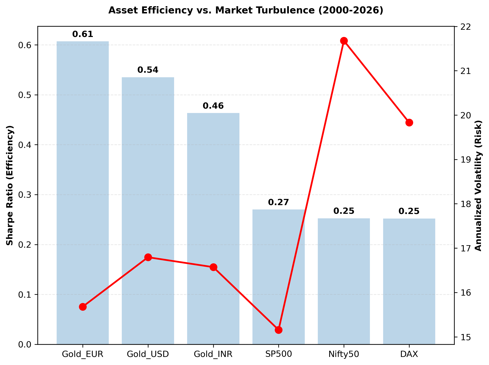
    </td>
    <td valign="top">
      <ul>
        <li><strong>Benchmarking:</strong> Uses localized 10-year bond yields (USD: 3.24%, INR: 7.42%, EUR: 1.81%) to ensure accurate "Excess Return" calculation per economy.</li>
        <li><strong>Efficiency:</strong> A higher Sharpe ratio indicates superior investment efficiency.</li>
        <li><strong>Visualization:</strong> Combines a bar chart (Sharpe) with a line graph (Volatility) to identify assets offering "High Reward for Low Stress".</li>
      </ul>
    </td>
  </tr>
</table>

<table>
  <tr><th colspan="2" align="left"><h3>Gold & Inflation Analysis</h3></th></tr>
  <tr>
    <td align="center">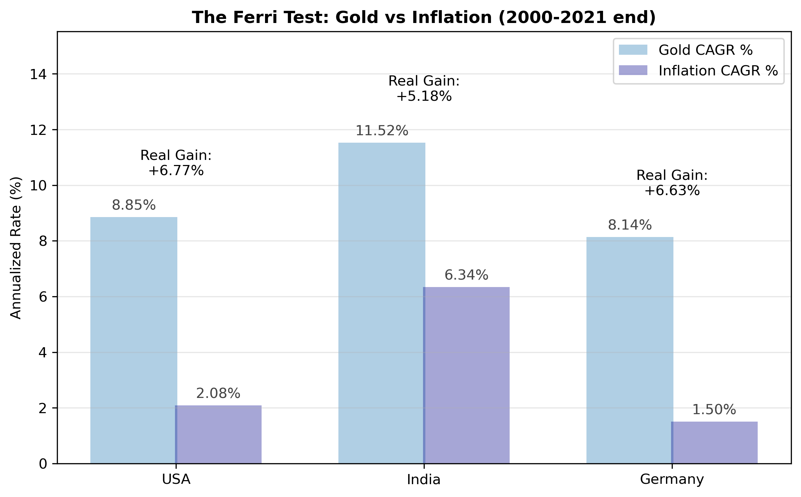</td>
    <td align="center">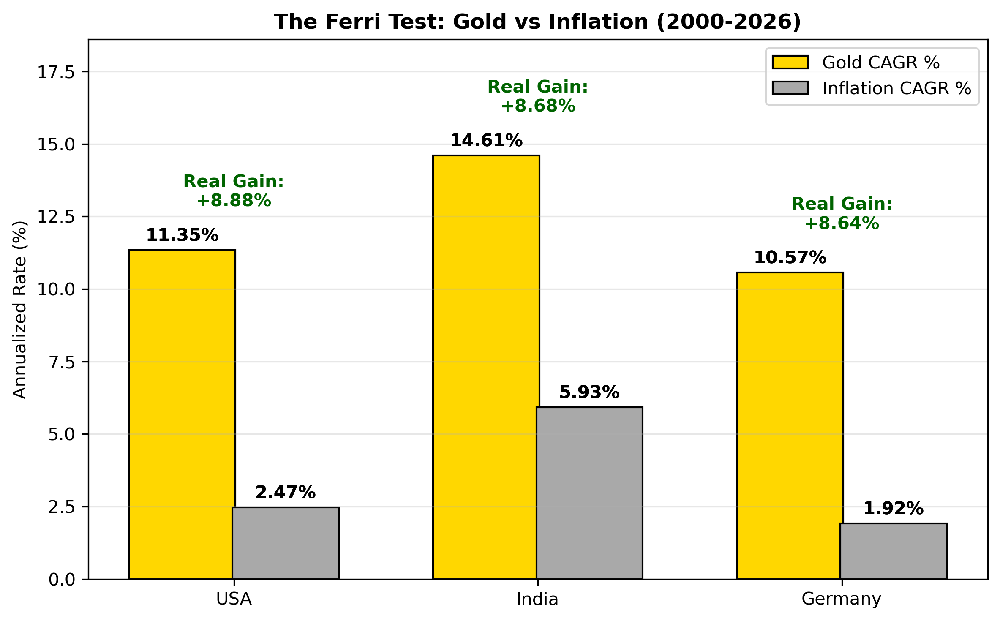</td>
  </tr>
  <tr>
    <td colspan="2" valign="top">
      <ul>
        <li><strong>CAGR Logic:</strong> Standardizes multi-year growth into a single annual price series for comparison across decades.</li>
        <li><strong>Purchasing Power:</strong> A positive result indicates that Gold successfully preserved and increased purchasing clarity.</li>
      </ul>
    </td>
  </tr>
</table>

<table>
  <tr><th colspan="2" align="left"><h3>Rolling Sharpe Ratio Analysis</h3></th></tr>
  <tr>
    <td colspan="2" align="center">
      
<li>The rolling Sharpe ratio tracks how the risk-adjusted return of gold evolves relative to equity benchmarks over time, helping to identify periods where gold acts as a superior store of value versus market indices.</li>

    </td>
  </tr>
  <tr>
    <td align="center">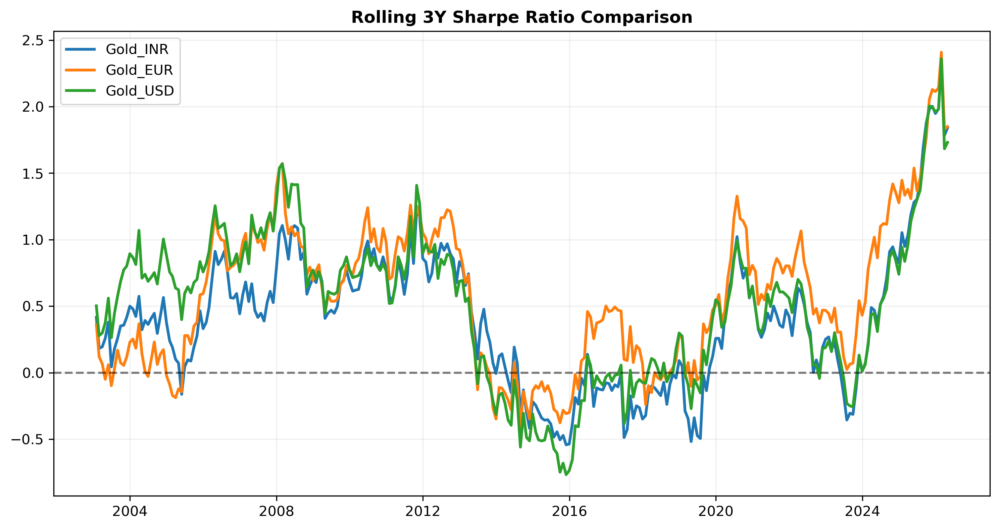</td>
    <td align="center">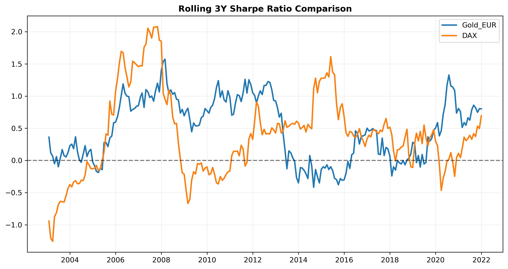</td>
  </tr>
  <tr>
    <td align="center">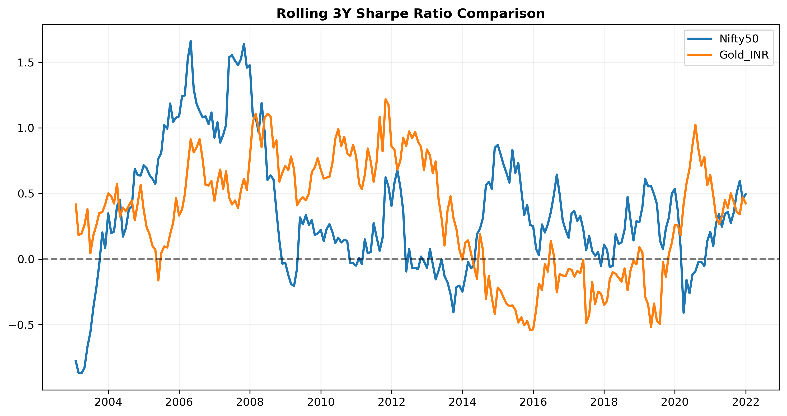</td>
    <td align="center">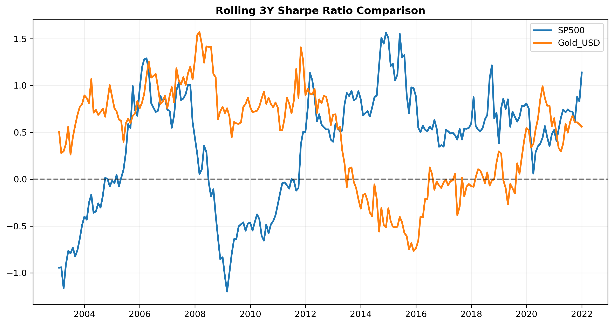</td>
  </tr>
</table>

  
<table>
  <tr><th colspan="2" align="left"><h3>Global Return Attribution: Deconstructing the Gains</h3></th></tr>
  <tr>
    <td valign="top" width="300">
      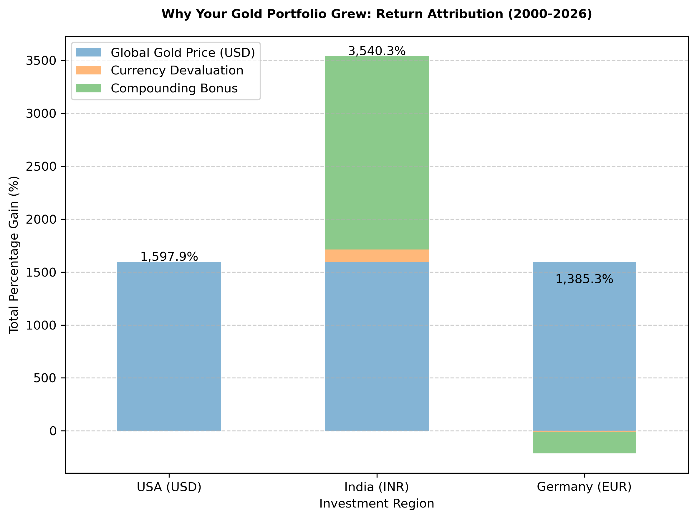
    </td>
    <td valign="top">
      <ol>
        <li><strong>Global Gold Price (USD):</strong> The baseline appreciation of the asset on the world market.</li>
        <li><strong>Currency Devaluation:</strong> The additional gain (or loss) caused by the local currency's movement against the US Dollar.</li>
        <li><strong>Compounding Bonus (Interaction):</strong> The exponential growth caused by holding an appreciating asset in a strengthening currency.</li>
      </ol>
    </td>
  </tr>
</table>

 

<table>
  <tr><th colspan="2" align="left"><h3>Nominal vs. Real Global Comparison</h3></th></tr>
  <tr>
    <td valign="top" width="300">
      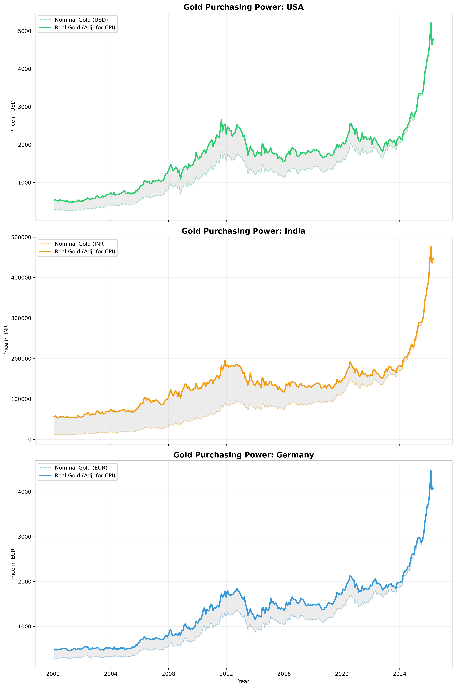
    </td>
    <td valign="top">
      <strong>Global Purchasing Power:</strong>
      <ul>
        <li><strong>The "Shaded Gap":</strong> Represents the cumulative loss of currency value. A wider gap indicates higher local inflation and a greater need for Gold as a hedge.</li>
        <li><strong>Regional Comparison:</strong> 
          <ul>
            <li><em>India:</em> Typically shows the widest gap, highlighting the Rupee's historical struggle against inflation.</li>
            <li><em>USA/Germany:</em> Show narrower gaps, indicating higher currency stability relative to the Gold standard.</li>
          </ul>
        </li>
        <li><strong>The Investor's Reality:</strong> If the "Real Gold" line is flat while the [nominal line] rises, it indicates that price gains are being neutralized by inflation.</li>
      </ul>
    </td>
  </tr>
</table>

  
<table>
  <tr><th colspan="1" align="left"><h3>Realistic Wealth Accumulation: Dollar Cost Averaging (DCA) with Friction</h3></th></tr>
  <tr>
    <td valign="top">
      
This section simulates a monthly investment strategy (DCA) of €100, comparing a direct investment in Germany against a cross-border investment in India while accounting for real-world transaction costs.

      <ul>
        <li><strong>Friction and "Drift":</strong> Applies investment-grade parameters such as India's customs duties, GST (3%), and bank premiums (~10% total friction), plus currency transfer spreads (0.5%). Note: Given the recent increase in India's gold import duty to 15% aimed at forex preservation, the actual output for the India strategy is projected to be approximately 5% lower than the value visualized in the chart below.</li>
        <li><strong>Strategies:</strong>
          <ul>
            <li><em>Germany:</em> Direct monthly purchase of Gold at the international EUR spot price.</li>
            <li><em>India:</em> Converts EUR to INR, pays transfer fees, and purchases at the localized (higher) price.</li>
          </ul>
        </li>
        <li><strong>The "Efficiency Loss" Verdict:</strong> By converting the final Indian portfolio value back into EUR, the model quantifies the "cost of geography"—how much wealth is eroded by local taxes and transfer fees over 26 years, even though gold prices often rise due to the currency devaluation factors observed in the Global Return Attribution analysis.</li>
        <li><strong>Wealth Accumulation Plot:</strong> Visualizes the "drift" between the solid blue line (Germany) and dashed red line (India) to illustrate cumulative friction impact.</li>
      </ul>
    </td>
  </tr>
  <tr>
    <td align="center">
      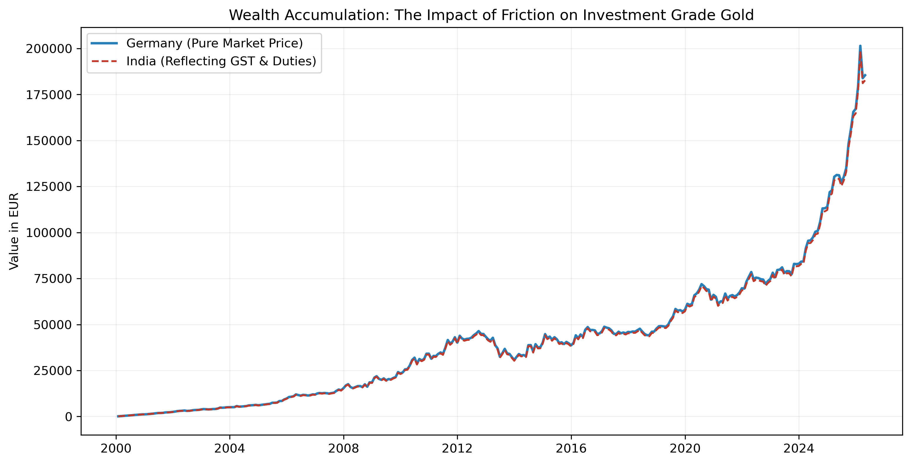
    </td>
  </tr>
</table>

  
<table>
  <tr><th align="left"><h3>Trading Volume</h3></th></tr>
  <tr>
    <td>
      
<strong>Analysis: Observations from 26 Years of Gold Trading Volume</strong>

      <ul>
        <li><strong>Short-Term Growth Trend:</strong> A gradual upward slope in trading volume over the last few years indicates institutional adoption and the rise of gold-backed ETFs, making the asset more accessible than ever before.</li>
      </ul>
    </td>
  </tr>
      <tr>
    <td colspan="1" align="center">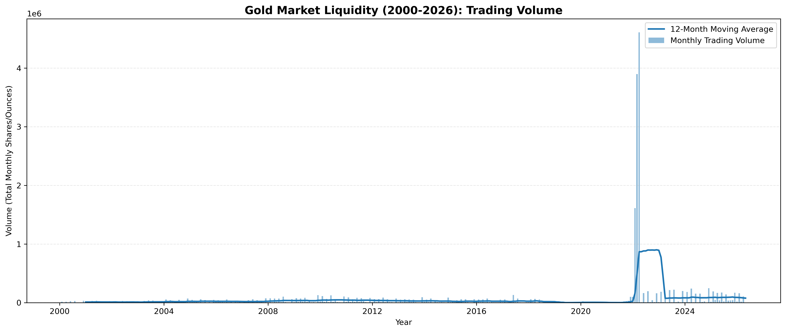</td>
  </tr>
</table>

<h3>Key Research Takeaways</h3>
<ul>
  <li><strong>Gold as a Wealth Protector:</strong> With a 26-year CAGR of 10.5%–14.6% against an inflation rate of 1.9%–5.9%, gold has not merely preserved value but significantly enhanced purchasing power over the long term.</li>
  <li><strong>The "Alternative Asset" Reality:</strong> The near-zero correlation (–0.11 to 0.02) demonstrates that gold does not function as a reactive inflation hedge; rather, it moves as an independent currency alternative.</li>
  <li><strong>Currency Dynamics (INR vs. EUR):</strong> Gold returns in India (14.6%) outperformed those in Germany (10.6%) because the strategy captured both the rising global gold price and the structural depreciation of the Rupee.</li>
  <li><strong>Multiplier Effect:</strong> In India, INR depreciation acted as a "multiplier," significantly boosting nominal local returns. Conversely, in Germany, the relative strength of the EUR against the USD acted as a performance drag, illustrating how a strong local currency can dampen nominal gains for USD-denominated commodities.</li>
</ul>

<h3>Future Roadmap</h3>

<strong>Predictive Modeling (In Development):</strong> An integrated machine learning module is currently being developed to forecast gold price trends based on historical volatility and macroeconomic indicators. This component will be added upon completion.
